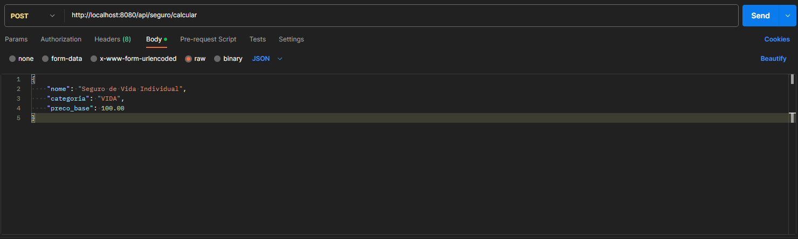
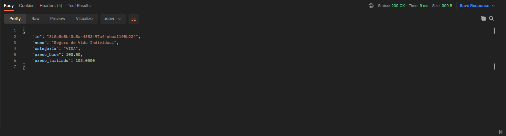

# Desafio Produtos de Seguros 🚀

## <a name="dicas">Resolução</a>

Hoje me encontro como Júnior em um Monólito Legada que utiliza Java 8 e arquitetura em camadas. Antes de resolver o desafio, pesquisei mais sobre Clean Architecture e SOLID.
Apartir daí, começei o desafio.

  Segui com a arquitetura em camadas, porém, com a separação de pacotes por funcionalidades,
Java 21 e SpringBoot 3.
  A princípio separei as constantes em um record, funcionalidade nova do Java 17. Criei um Factory para criar o objeto Seguro e o cálculo do Preço Tarifado.
O Service ficou responsável por chamar o Factory e salvar no banco de dados. Faço algumas validações tanto no service quanto no factory.
Criei um Mapper para converter o objeto salvo em DTO. Por fim nos testes, utilizei o JUnit 5 e Mockito. As classes de entidade e DTO não tiverem foco no teste, como
utilizei o JPA, também não houve testes no repository.
  Acredito que a solução ficou simples e eficiente, porém, com a possibilidade de melhorias que acredito que deva existir.
  Em anexo vou colocar exemplos de requisições e respostas.

  Aqui temos uma requisão a api na rota /api/segura/calcular com o método POST:
  

  E aqui a resposta: (Usei o ID UUDI para ter mais segurança, escabilidade e unicidade)
  

